# OSTP - Ospab Stealth Transport Protocol

[Русский язык](README.ru.md) · [Wiki](https://github.com/ospab/ostp/wiki) · [Contributing](CONTRIBUTING.md) · [Releases](https://github.com/ospab/ostp/releases)


> A fast, custom encrypted transport protocol written in Rust.

**OSTP** (Ospab Stealth Transport Protocol) is a high-performance transport protocol. It implements a custom ARQ transport over UDP, as well as a UoT (UDP-over-TCP) mode. Every byte on the wire - including packet headers - is cryptographically indistinguishable from random noise, making it highly resistant to Deep Packet Inspection (DPI).

---

## Quick Install

### Linux
```bash
bash <(curl -Ls https://raw.githubusercontent.com/ospab/ostp/master/scripts/install.sh)
```

### Windows (PowerShell, run as Administrator)
```powershell
irm https://raw.githubusercontent.com/ospab/ostp/master/scripts/install.ps1 | iex
```

### Manual Download
Download pre-built binaries for your platform from [GitHub Releases](https://github.com/ospab/ostp/releases).

---

## Key Features

| Feature | Description |
|---------|-------------|
| **Full Traffic Obfuscation** | Every packet - including headers - is indistinguishable from random noise. Session IDs and nonces are masked with per-packet HMAC-derived keys. |
| **Noise Protocol Handshake** | `Noise_NNpsk0_25519_ChaChaPoly_BLAKE2s` - PSK-authenticated, forward-secret key exchange with no static identity exposure. |
| **Reliable UDP (ARQ)** | Selective ACK/NACK with rate-limited retransmission, configurable reorder buffer, and exponential backoff. |
| **Multiplexed Streams** | Multiple logical TCP streams over a single encrypted UDP session with per-stream flow control. |
| **Seamless Roaming** | Clients can switch networks (WiFi ↔ LTE) without session interruption - tracked by session-ID, not IP. |
| **Management API** | Built-in REST API for third-party panels (3x-ui, custom dashboards). Per-user stats, traffic limits, key CRUD. |
| **Fallback Server** | TCP fallback proxy to a web server - makes OSTP indistinguishable from nginx during active probing. |
| **Multi-Listener** | Bind to multiple addresses simultaneously (dual-stack IPv4/IPv6, multi-port). |
| **TUN Mode** | Full-system VPN via native `smoltcp` network stack without external dependencies. All traffic transparently routed through the tunnel. |
| **UoT (UDP-over-TCP)** | Bare UDP-over-TCP tunnel, no protocol mimicry. Since all data is fully encrypted and length-prefixed, it bypasses DPI filters that block unknown UDP traffic by riding over a plain TCP connection. |
| **Mobile & Web Apps** | Beautiful cross-platform mobile client (Flutter) and a modern Web Control Panel (React/Vite) for effortless server and client management. |
| **TURN Relay** | RFC 5766 TURN support for environments where direct UDP is blocked. |
| **Hot-Reload** | Runtime config reload without restart (access keys, exclusions, mux settings). |
| **Structured Logging** | `tracing`-based logging with `RUST_LOG` filtering. JSON/file/syslog output support. |
| **Cross-Platform** | Windows, Linux, macOS, Android, FreeBSD, MIPS, RISC-V. Single binary, no runtime dependencies. |

---

## Architecture

```mermaid
flowchart LR
    %% Styles
    classDef userApp fill:#e1f5fe,stroke:#01579b,stroke-width:2px,color:#01579b
    classDef ostpCore fill:#e8f5e9,stroke:#2e7d32,stroke-width:2px,color:#2e7d32
    classDef network fill:#fff3e0,stroke:#e65100,stroke-width:2px,color:#e65100,stroke-dasharray: 5 5
    classDef external fill:#f3e5f5,stroke:#4a148c,stroke-width:2px,color:#4a148c
    classDef fallback fill:#ffebee,stroke:#c62828,stroke-width:2px,color:#c62828

    subgraph Local["💻 Client Device"]
        Apps["Web Browser / Apps"]:::userApp
        Socks["SOCKS5 / HTTP Proxy"]:::ostpCore
        Tun["Global TUN (VPN)"]:::ostpCore
        Client["OSTP Client Protocol Engine\n(Noise + ChaCha20 + ARQ)"]:::ostpCore

        Apps -->|TCP/UDP| Socks
        Apps -->|IP Packets| Tun
        Socks --> Client
        Tun --> Client
    end

    subgraph Internet["🌐 Hostile Network (DPI/Firewall)"]
        Tunnel{"Fully Obfuscated\nEncrypted UDP\n(Looks like noise)"}:::network
    end

    subgraph Remote["🖥️ Remote VPS (Server)"]
        Server["OSTP Server Protocol Engine\n(Authentication & Decryption)"]:::ostpCore
        Relay["Connection Multiplexer"]:::ostpCore
        Fallback["Fake Website\n(Nginx/Caddy)"]:::fallback
        Target["Open Internet\n(YouTube, Google, etc)"]:::external

        Server -->|Decrypted Traffic| Relay
        Server -->|Active Probe / Scanner| Fallback
        Relay -->|Clear Traffic| Target
    end

    Client <==> Tunnel <==> Server
```



---

## Quick Start

### 1. Generate config

```bash
# On your VPS (server):
./ostp init server

# On your machine (client):
./ostp init client
```

### 2. Edit config

**Server** - set your access keys:
```jsonc
{
  "mode": "server",
  "listen": "0.0.0.0:50000",
  "access_keys": ["YOUR_SECRET_KEY"],
  "api": { "enabled": true, "bind": "127.0.0.1:9090", "token": "admin-token" },
  "fallback": { "enabled": false, "listen": "0.0.0.0:443", "target": "127.0.0.1:8080" }
}
```

**Client** - point to your server:
```jsonc
{
  "mode": "client",
  "server": "YOUR_SERVER_IP:50000",
  "access_key": "YOUR_SECRET_KEY",
  "socks5_bind": "127.0.0.1:1088",
  "transport": { "mode": "udp" },
  "tun": { "enable": false, "dns": "1.1.1.1" }
}
```

### 3. Run

```bash
./ostp                         # Uses config.json in current directory
./ostp --config /path/to.json  # Custom config path
./ostp check                   # Validate config without running
./ostp gk                      # Generate a new access key
./ostp links                   # Print client share links
```

### 4. Connect via share link (one-liner)
```bash
./ostp connect "ostp://ACCESS_KEY@server.com:50000?..."
```

> [!WARNING]
> Always wrap the `ostp://...` link in quotes (`"`) so your terminal doesn't misinterpret special characters like `&` or `?`.

---

## Management API

Built-in REST API for building panels and dashboards.

```bash
# Server status
curl -H "Authorization: Bearer mytoken" http://127.0.0.1:9090/api/server/status

# List all users with traffic stats  
curl -H "Authorization: Bearer mytoken" http://127.0.0.1:9090/api/users

# Create a user with 10GB traffic limit
curl -X POST -H "Authorization: Bearer mytoken" \
  -H "Content-Type: application/json" \
  -d '{"limit_bytes": 10737418240}' \
  http://127.0.0.1:9090/api/users
```

Full API reference: [Management API](https://github.com/ospab/ostp/wiki/Management-API)

---

## CLI Reference

```
ostp [--config <PATH>] [COMMAND]

Commands:
  run                    Run the daemon using the config file (default when no command is given)
  connect <URL>          Connect once using a share link: ostp://KEY@HOST:PORT
  setup                  Interactive setup wizard
  init <MODE>            Generate a template config (server/client/relay)
  check                  Validate the configuration file and exit
  gk                     Generate a secure access key (alias: generate-key)
    --format <FMT>         Key format: hex, base64 (default: hex)
    -n, --count <N>        Number of keys to generate (default: 1)
  links                  Print client share links from the server config
  import <URL>           Import a share link into the config file
  update                 Update OSTP to the latest release
    -b, --branch <NAME>    Release channel: stable, beta, alpha (default: stable)
    -v, --version <VER>    Update to an exact version instead of the channel's latest
  migrate                Force-migrate the configuration file to the current format
  proxy-env              Print shell export commands for the local SOCKS proxy
  proxy-env-clear        Print shell export commands to unset it
  uninstall              Stop the service and remove the binary and config

Global options:
  --config <PATH>        Config file path (default: config.json)
```

Every subcommand also accepts `-h`/`--help` for its own option list.

---

## Protocol Summary

| Layer | Mechanism |
|-------|-----------|
| Key Exchange | Noise NNpsk0 (X25519 + ChaChaPoly + BLAKE2s) zero-RTT |
| Encryption | ChaCha20-Poly1305 AEAD per-packet |
| Header Obfuscation | HMAC-SHA256 derived per-packet mask |
| Reliability | Selective ACK with cumulative + SACK ranges |
| Retransmission | Rate-limited NACK + exponential backoff RTO |
| Keepalive | Ping/Pong with RTT measurement every 5s |

---

## Building from Source

```bash
# Prerequisites: Rust 1.75+
cargo build --release

# Cross-compile for Linux
cross build --release --target x86_64-unknown-linux-gnu

# Run tests
cargo test -p ostp-core -p ostp-server
```

---

## Documentation

- **[Wiki](https://github.com/ospab/ostp/wiki)** - Full documentation
- [Installation](https://github.com/ospab/ostp/wiki/Installation)
- [Configuration Reference](https://github.com/ospab/ostp/wiki/Configuration)
- [Management API](https://github.com/ospab/ostp/wiki/Management-API)
- [Protocol Design](https://github.com/ospab/ostp/wiki/Protocol-Design)
- [Building from Source](https://github.com/ospab/ostp/wiki/Building-from-Source)
- [FAQ](https://github.com/ospab/ostp/wiki/FAQ)
- [Domains and TLS](docs/en/tls.md)
- [Test protocol](docs/en/testing.md)

---

## License

GNU Affero General Public License v3.0 (AGPL-3.0). See [LICENSE](LICENSE) for the full text.

---

## Contact

- **Telegram**: [@ospab0](https://t.me/ospab0)
- **Email**: gvoprgrg@gmail.com
