# OSTP - Ospab Stealth Transport Protocol

[English](README.md) · [Contributing](CONTRIBUTING.ru.md)


> Быстрый кастомный зашифрованный транспортный протокол на Rust.

**OSTP** (Ospab Stealth Transport Protocol) - кастомный транспортный протокол. Реализует собственный ARQ-транспорт поверх UDP, а также режим UoT (UDP-over-TCP). Каждый байт, включая заголовки пакетов, криптографически неотличим от случайного шума, что делает его устойчивым к системам глубокого анализа трафика (DPI).

---

## Возможности

| Возможность | Описание |
|-------------|----------|
| **Обфускация трафика** | Каждый пакет, включая заголовки, неотличим от случайного шума. Session ID и nonce маскируются HMAC-ключами, уникальными для каждого пакета. |
| **Noise Protocol** | `Noise_NNpsk0_25519_ChaChaPoly_BLAKE2s` - аутентификация через PSK, forward secrecy, без раскрытия идентичности. |
| **Reliable UDP (ARQ)** | Selective ACK/NACK с rate-limited ретрансмиссией, настраиваемым reorder-буфером и exponential backoff. Разработан для 10 Гбит/с. |
| **Мультиплексирование** | Несколько логических TCP-потоков поверх одной зашифрованной UDP-сессии с per-stream flow control. |
| **Бесшовный роуминг** | Клиент может менять сети (WiFi ↔ 4G) без разрыва сессии - сервер отслеживает session-ID, а не IP-адрес. |
| **TUN-режим** | Полносистемный VPN без внешних зависимостей (встроенный network stack на базе `smoltcp`). |
| **UoT (UDP-over-TCP)** | Голый туннель UDP-over-TCP, без имитации протоколов. Поскольку все данные полностью зашифрованы и имеют префикс длины, он обходит DPI фильтры, блокирующие неизвестный UDP трафик, передавая всё по обычному TCP соединению. |
| **Мобильные и Web приложения** | Красивый кроссплатформенный мобильный клиент (Flutter) и современная Web панель управления (React/Vite) для удобного администрирования. |
| **TURN Relay** | RFC 5766 TURN для окружений, где прямой UDP заблокирован. |
| **Hot-Reload** | Перезагрузка конфига в рантайме без перезапуска (ключи, исключения, mux, TURN). |
| **Кросс-платформа** | Windows, Linux, macOS, Android. Один бинарник, без зависимостей. |

---

## Архитектура

```mermaid
flowchart LR
    %% Styles
    classDef userApp fill:#e1f5fe,stroke:#01579b,stroke-width:2px,color:#01579b
    classDef ostpCore fill:#e8f5e9,stroke:#2e7d32,stroke-width:2px,color:#2e7d32
    classDef network fill:#fff3e0,stroke:#e65100,stroke-width:2px,color:#e65100,stroke-dasharray: 5 5
    classDef external fill:#f3e5f5,stroke:#4a148c,stroke-width:2px,color:#4a148c
    classDef fallback fill:#ffebee,stroke:#c62828,stroke-width:2px,color:#c62828

    subgraph Local["💻 Устройство клиента"]
        Apps["Браузер / Приложения"]:::userApp
        Socks["SOCKS5 / HTTP Прокси"]:::ostpCore
        Tun["Global TUN (VPN)"]:::ostpCore
        Client["OSTP Клиент\n(Noise + ChaCha20 + ARQ)"]:::ostpCore

        Apps -->|TCP/UDP| Socks
        Apps -->|IP Пакеты| Tun
        Socks --> Client
        Tun --> Client
    end

    subgraph Internet["🌐 Сеть с цензурой (DPI)"]
        Tunnel{"Зашифрованный UDP\n(Выглядит как белый шум)"}:::network
    end

    subgraph Remote["🖥️ Удаленный сервер (VPS)"]
        Server["OSTP Сервер\n(Аутентификация)"]:::ostpCore
        Relay["Мультиплексор соединений"]:::ostpCore
        Fallback["Фейковый сайт\n(Nginx/Caddy)"]:::fallback
        Target["Свободный интернет\n(YouTube, Google и т.д.)"]:::external

        Server -->|Расшифрованный трафик| Relay
        Server -->|Сканеры цензоров| Fallback
        Relay -->|Чистый трафик| Target
    end

    Client <==> Tunnel <==> Server
```



---

## Установка

### Linux
```bash
bash <(curl -Ls https://raw.githubusercontent.com/ospab/ostp/master/scripts/install.sh)
```

### Windows (PowerShell от Администратора)
```powershell
irm https://raw.githubusercontent.com/ospab/ostp/master/scripts/install.ps1 | iex
```

---

## Конфигурация

Создать конфиг по умолчанию:
```bash
./ostp init server   # VPS
./ostp init client   # Локальная машина
```

### Сервер (`config.json`)
```jsonc
{
  "mode": "server",
  "listen": "0.0.0.0:50000",
  "access_keys": ["ВАШ_КЛЮЧ"],
  "debug": false,
  // Опционально: проксировать трафик через upstream
  "outbound": {
    "enabled": false,
    "protocol": "socks5",
    "address": "127.0.0.1",
    "port": 9050,
    "default_action": "proxy"
  }
}
```

### Клиент (`config.json`)
```jsonc
{
  "mode": "client",
  "server": "IP_СЕРВЕРА:50000",
  "access_key": "ВАШ_КЛЮЧ",
  "socks5_bind": "127.0.0.1:1088",
  "debug": false,
  // Настройки транспорта (udp или uot)
  "transport": {
    "mode": "udp"
  },
  // TUN-режим (полносистемный VPN)
  "tun": {
    "enable": false,
    "dns": "1.1.1.1"
  },
  // Мультиплексирование: несколько UDP-сессий
  "mux": {
    "enabled": false,
    "sessions": 2
  },
  // TURN-реле для заблокированных сетей
  "turn": {
    "enabled": false,
    "server_addr": "turn.example.com:3478",
    "username": "user",
    "access_key": "pass"
  },
  // Исключения (идут напрямую, минуя туннель)
  "exclude": {
    "domains": ["example.local"],
    "ips": ["192.168.0.0/16"]
  }
}
```

---

## Использование

```bash
# Запуск с конфигом
./ostp --config config.json

# Или просто (ищет config.json рядом с бинарником)
./ostp
```

### Справка по командам

```
ostp [--config <PATH>] [КОМАНДА]

Команды:
  run                    Запустить демон по конфигу (по умолчанию, если команда не указана)
  connect <URL>          Подключиться по share-ссылке: ostp://KEY@HOST:PORT
  setup                  Интерактивный мастер настройки
  init <MODE>            Сгенерировать шаблон конфига (server/client/relay)
  check                  Проверить конфиг и выйти
  gk                     Сгенерировать access-key (алиас: generate-key)
    --format <FMT>         Формат ключа: hex, base64 (по умолчанию hex)
    -n, --count <N>        Количество ключей (по умолчанию 1)
  links                  Вывести client-share-ссылки из серверного конфига
  import <URL>           Импортировать share-ссылку в конфиг
  update                 Обновить OSTP до актуального релиза
    -b, --branch <NAME>    Канал релиза: stable, beta, alpha (по умолчанию stable)
    -v, --version <VER>    Обновиться на точную версию вместо последней в канале
  migrate                Принудительно мигрировать конфиг к текущему формату
  proxy-env              Вывести shell-команды для локального SOCKS-прокси
  proxy-env-clear        Вывести shell-команды для их отмены
  uninstall              Остановить сервис и удалить бинарник с конфигом

Глобальные опции:
  --config <PATH>        Путь к конфигу (по умолчанию config.json)
```

У каждой подкоманды есть своя справка через `-h`/`--help`.

### TUN-режим (Windows)
Использует встроенный сетевой стек `smoltcp` и виртуальный адаптер `wintun` (необходима `wintun.dll`). Требует запуска с правами Администратора.

### TUN-режим (Linux)
Использует встроенный сетевой стек `smoltcp` и `/dev/net/tun`. Требует запуска от имени `root` (или наличия `CAP_NET_ADMIN`).

---

## Спецификация протокола

| Уровень | Механизм |
|---------|----------|
| Обмен ключами | Noise NNpsk0 (X25519 + ChaChaPoly + BLAKE2s) zero-RTT |
| Шифрование | ChaCha20-Poly1305 AEAD на каждый пакет |
| Обфускация заголовков | HMAC-SHA256 маска session_id + nonce, уникальная для каждого пакета |
| Надёжность | Selective ACK с cumulative + SACK диапазонами |
| Ретрансмиссия | Rate-limited NACK (30мс cooldown) + exponential backoff RTO |
| Flow Control | Окно in-flight (только retransmittable фреймы) |
| Keepalive | Ping/Pong с измерением RTT каждые 5с |
| Таймаут сессии | 60с на клиенте, 300с на сервере |

---

## Сборка из исходников

```bash
# Требования: Rust toolchain (1.75+)
cargo build --release

# Кросс-компиляция для Linux
cross build --release --target x86_64-unknown-linux-gnu
```

---

## Документация

- [Архитектура](docs/ru/architecture.md)
- [Спецификация протокола](docs/ru/specification.md)
- [Дизайн обфускации](docs/ru/obfuscation.md)
- [Администрирование сервера](docs/ru/server.md)
- [Настройка клиента](docs/ru/client.md)
- [Интеграции](docs/ru/integrations.md)
- [Домены и TLS](docs/ru/tls.md)
- [Протокол тестирования](docs/ru/testing.md)

---

## Лицензия

GNU Affero General Public License v3.0 (AGPL-3.0). Полный текст - в файле [LICENSE](LICENSE).
